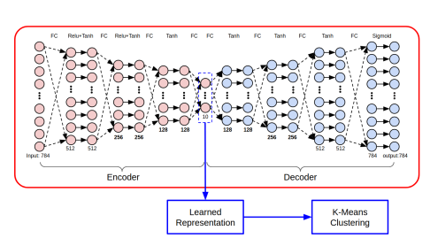
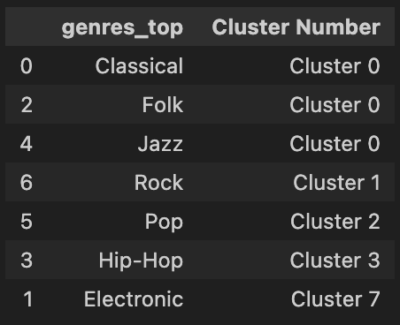

# 🎻 Music Genre Clustering

_Project Report_

### 📂 Dataset

FMA (Free Music Archive) Dataset: [website](https://freemusicarchive.org/) | [paper](https://arxiv.org/pdf/1612.01840.pdf) | [github](https://github.com/mdeff/fma/blob/master/baselines.ipynb)

The FMA dataset contains information about all the genres that a track can be categorized under, as well as information about the audio in itself.

### 📌 Focus Questions

Genre classification is a highly subjective process, changing on the basis of cultures and experience. My goal through this project is to identify how genres can be identified through a more quantitative process i.e. by clustering the tracks on the basis of the fundamental audio features of the track.
As defined by Spotify, the [essential features](https://help.spotontrack.com/article/what-do-the-audio-features-mean) that I have focused on are as follows:

1. Acousticness (confidence of the track being acoustic)
2. Danceability (tempo, rhythm stability, beat strength, and overall regularity)
3. Energy (intensity, dynamic range, perceived loudness, timbre, onset rate, and general entropy)
4. Instrumentalness
5. Liveness (presence of an audience)
6. Speechiness (presence of spoken words in a track)
7. Tempo (BPM)
8. Valence (musical positiveness or cheerfulness)

### 🧹 Dataset cleaning procedure

The general steps I followed to clean this dataset are

1. Fix data types
2. Fix indexing and multilevel indexing
3. Group subgenres into broader genres
4. Handle missing data: Data imputation / removal
5. Visualize data distributions
6. Merge all required and cleaned data into a single file and save it

### 🧮 Algorithm / Model Architecture

I decided to take a twist on the standard K-Means procedure by first reducing the dimensionality of data using a Autoencoder then performing clustering on the compressed representation. The idea was to combat the issue that clustering faces through the [curse of dimensionality](https://en.wikipedia.org/wiki/Curse_of_dimensionality), wherein it's performance suffers at higher dimensional of inputs.

By first training an [autoencoder](https://www.tensorflow.org/tutorials/generative/autoencoder), I reduced the dimensionality from 8 (8 primary audio features defined previously) to 5 (selected through manual trials). The encoder compresses the data to only retain the vital features. After this, K-Means performs clustering based on this compressed data to assign classes to each of the tracks.

This approach is effective for identifying patterns and similarities within large datasets, as it is capable of simplifying the information while preserving the key characteristics of the data, enabling more efficient clustering and analysis.

Here is a figure from a paper that also proposes a similar procedure. While the paper defines a deeper neural network, I choose to use fewer layers to prevent overfitting.

  
_"Lu, Si, and Ruisi Li. "DAC: Deep Autoencoder-based Clustering, a General Deep Learning Framework of Representation Learning." Portland State University."_

### Additional information

Other models I tried using before settling on the Autoencoder-K Means architecture are the following:

- DBSCAN
- Autoencoder-DBSCAN
- K Means
- CNN

### 📝 Analysis

Considering that the goal of this project was to see how quantitative genre classification compares to qualitative genre classification, I thought it would be better to first introduce a qualitative discussion of the results as they compare to my understanding of different genres.

The clustering algorithms eventually formed the following clusters:  

- Classical, folk, jazz were clustered together
- Pop formed its own cluster
- Electronic formed its own cluster
- Hip-Hop formed its own cluster
- Rock formed its own cluster

Notably, classical, folk and jazz all tend to have relatively acoustic sounds but typically of different instruments However, the dataset utlized only contained this information through a confidence score of whether the track was acoustic or not, without identifying the type instrument. Moreover, these genres also often observe similar levels of instrumentalness, speechiness, and liveliness. Therefore, it makes sense that these would be clustered together at a lack of differentiation of instruments utilized.

### 📊 Evaluation Metrics

I selected the:

- Davies-Bouldin Index; and
- Calinski-Harabasz Index

for my evaulation metrics, both of which are popular choices for evaluating clustering algorithms.

Both indices provide easily interpretable results. Lower values of the Davies-Bouldin Index indicate better clustering, as it measures the average similarity between each cluster and its most similar cluster.  
Meanwhile, higher values of the Calinski-Harabasz Index indicate better clustering, as it measures the ratio of dispersion between and within clusters.

In the context of genre classification, tracks have been clustered with others that have apparently similar audio features. So these scores would give us a quantitative method to compare how similar different songs that have grouped together are, and also how different each genre is from the others.

Therefore, by considering the two metrics, we can get a full picture of clustering through the comparison of tracks within each genre as well as across different genre.

### 📚 Resources Utilized

> _"Lu, Si, and Ruisi Li. "DAC: Deep Autoencoder-based Clustering, a General Deep Learning Framework of Representation Learning." Portland State University." [\[link\]](https://arxiv.org/pdf/2102.07472.pdf)_
>
> FMA Dataset [\[github\]](https://github.com/mdeff/fma/tree/master?tab=readme-ov-file)
>
> Other genre clustering projects: [\[1\]](https://www.kaggle.com/code/shabanamir/unsupervised-ml-project-music-clustering) [\[2\]](https://medium.com/latinxinai/discovering-descriptive-music-genres-using-k-means-clustering-d19bdea5e443) > [Stern, Samuel Walter, "Analysis of Music Genre Clustering Algorithms" (2021). Theses and Dissertations. 2839.](https://dc.uwm.edu/cgi/viewcontent.cgi?article=3844&context=etd) > [GeeksForGeeks](https://www.geeksforgeeks.org/clustering-metrics/#steps-to-evaluate-clustering-using-sklearn)
